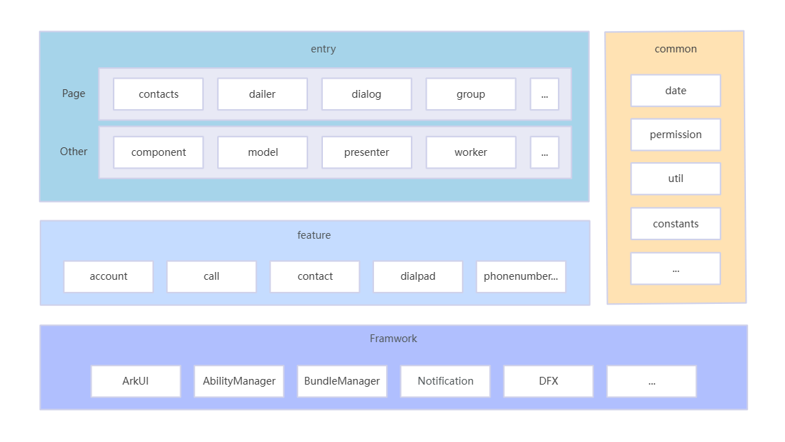

# Contacts

## Introduction

The Contacts application is a preset system application in OpenHarmony. The main functions include dial pad, call logs, contact list, contact details, contact settings, contact search, contact groups, contact favorites, contact management, and contact picker.

### Architecture diagram

The application architecture mainly combines MVP and domain-driven design ideas.

## File Tree

~~~
/Contacts/
├── common
├── feature
│   ├── account
│   ├── call
│   ├── contact
│   ├── dialpad
│   ├── phonenumber
├── entry                 
│   └── src
│       └── main
│           └── ets                        
│               ├── Application
│               ├── backup
│               ├── card
│               ├── component
│               ├── data
│               ├── dialogentryability
│               ├── entryformability
│               ├── feature
│               ├── interception
│               ├── listeners
│               ├── MainAbility
│               ├── model
│               ├── pages
│               ├── presenter
│               ├── privacyAbility
│               ├── speeddialability
│               ├── StaticSubscriber
│               ├── task
│               ├── uiExtentionAbility
│               ├── util
│               ├── workers
│               ├── workSchedulerExtensionAbility 
│           ├── resources 
├── signature
└── LICENSE
~~~

## Related Repos

[**applications_mms**](https://gitcode.com/openharmony/applications_mms)

[**applications_contactsdata**](https://gitcode.com/openharmony/applications_contactsdata)

[**applications_call**](https://gitcode.com/openharmony/applications_call)
