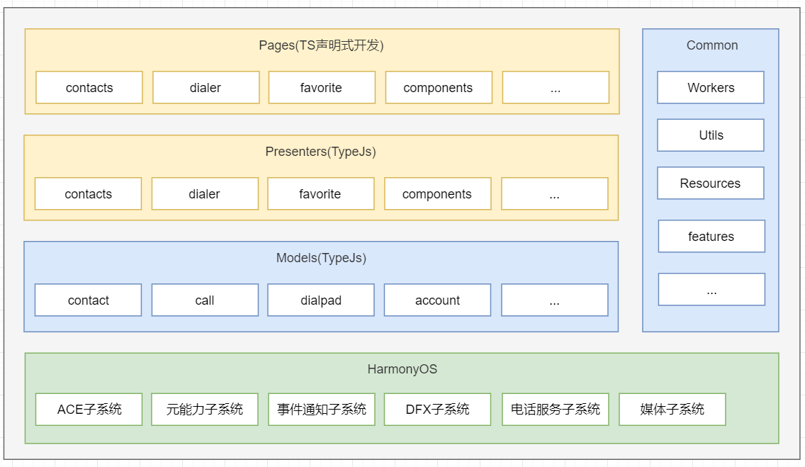

# 联系人

### 简介

Contacts应用是OpenHarmony中预置的系统应用，主要的功能包含拨号盘、通话记录查看、通话记录批量删除、联系人列表、详情查看、联系人的新建等功能；

### 架构图

### 目录

~~~
/Contacts/
├── doc                                    # 资料
├── entry                 
│   └── src
│       └── main
│           └── ets                        # js代码目录
│               └── MainAbility            # 公共页面样式
│                   ├── account            # 联系人账号
│                   ├── call               # 通话记录
│                   ├── component          # 组件封装
│                   ├── contact            # 联系人
│                       ├── contact        # 存储契约
│                       ├── entity         # 实体
│                       └── repo           # 仓库
│                   ├── dialpad            # 拨号盘
│                   ├── feature            # 特性集合
│                   |── model              # 模型
│                   |── pages              # TS声明式页面/组件
│                   |── presenter          # 页面展示逻辑
│                   |── util               # 工具类
│                   └── workers            # JS多线程服务
│               └── app.ets                # 应用生命周期/公共方法存放
│           ├── resources                  # 资源配置文件存放目录
│           └── config.json                # 全局配置文件
├── signs                                  # 签名
├── LICENSE
~~~

