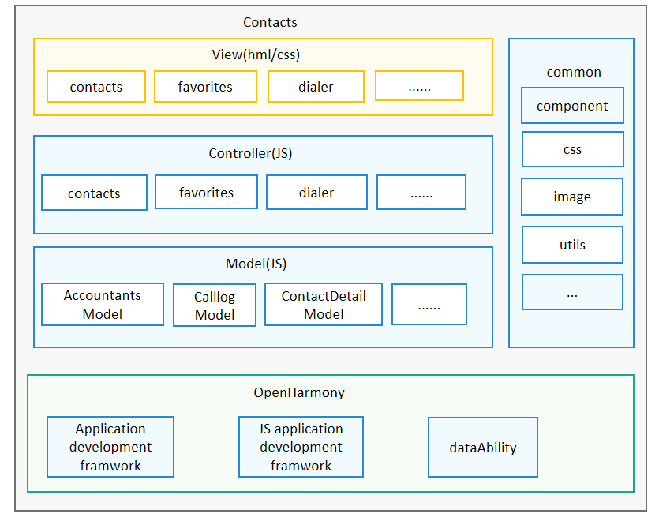

# Contacts<a name="ZH-CN_TOPIC_0000001103421572"></a>

-   [简介](#section11660541593)
    -   [架构图](#section48896451454)

-   [目录](#section161941989596)
-   [使用说明](#section123459000)
-   [相关仓](#section1371113476307)

## 简介<a name="section11660541593"></a>

Contacts应用是OpenHarmony中预置的系统运用，主要的功能包含拨号盘、通话记录查看、通话记录批量删除、联系人列表、详情查看、联系人的新建等功能

### 架构图<a name="section48896451454"></a>



## 目录<a name="section161941989596"></a>

```
/applications/standard/contacts
├── doc                                  # 架构图目录
├── entry                 
│   └── src
│       └── main
│           ├── config.json               # 全局配置文件
│           ├── resources                 # 资源配置文件存放目录
│           └── js                        # js代码目录
│               └── base                  # 公共css样式
│               └── common                # 公共页面样式
│               └── i18n                  # 国际化
│               └── model                 # 页面数据Model
│               └── pages                 # 页面/js逻辑样式
│               └── res                   # 资源文件
│               └── utils                 # 工具类
│               └── ServiceAbility        # 服务ability
│               └── app.js                # 应用生命周期/公共方法存放
├── LICENSE
```
## 使用说明 <a name="section123459000"></a>

   参见使用说明（[使用说明](./doc/Instructions.md)）

## 相关仓<a name="section1371113476307"></a>

系统应用

**applications\_standard\_contacts**

