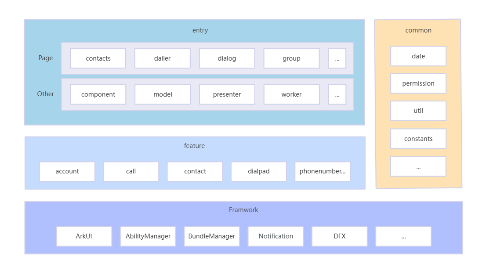

# 联系人应用

## 简介

### 内容介绍

Contacts应用是OpenHarmony中预置的系统应用，主要的功能包含包括拨号盘、通话记录、联系人列表、联系人详情、联系人设置、联系人搜索、联系人群组、联系人收藏、联系人管理、联系人Picker。

**核心功能：**

1. **拨号盘：** 提供拨号键盘展示与交互；支持拨号盘内搜索（号码）；拨号盘内搜索结果可查看详情、复制号码、标记为、新建联系人、保存至已有联系人；支持支持输入号码呼叫、输入号码按键音；支持拨号盘暗码能力及 IMEI 条形码显示。
2. **通话记录列表：** 显示全部通话记录；显示未接来电记录列表；支持通话记录查看详情；长按支持多选（批量删除）、复制号码、删除通话记录、新建联系人、保存至已有联系人、标记为。
3. **联系人卡片：** 提供联系人快捷方式；支持快速拨打入口、未接来电显示；支持在卡片侧添加联系人、删除联系人。
4. **联系人列表：** 支持联系人搜索（号码、姓名）；支持智能群组（单位、城市、最近联系人）和手机群组；手机群组支持新建群组、删除群组、添加成员、发送信息入口、移除成员及群组重命名；提供联系人列表索引；支持维护联系人头像、姓名、单位、职位、电话号码、电子邮件、备注、即时信息、电话铃声、住址、网站、生日及关联人（助理）等字段；
5. **联系人详情：** 详情页通话记录长按支持删除通话记录；电话号码长按支持复制到剪切板、设为默认；支持点击号码拨号；支持发送短信入口；支持联系人编辑；支持为联系人设置本地音乐铃声、视频铃声或无铃声。
6. **联系人 picker：** 提供联系人 picker 选取能力。
7. **联系人收藏：** 展示收藏联系人列表；支持将联系人加入收藏、取消收藏；支持排序；支持全选与取消全选。
8. **联系人设置：** 支持整理联系人（自动合并重复联系人、手动合并重复联系人、批量删除）；支持从存储设备与 SIM 卡导入联系人；支持导出联系人到存储设备；支持最近删除恢复。
9. **联系人增强功能：** 支持识别三大运营商。

### 架构图

该应用架构主要结合MVP+领域驱动设计思路。

## 目录

~~~
/Contacts/
├── common                                 # 通用工具
├── feature                                # 业务模块
│   ├── account                            # 联系人账号
│   ├── call                               # 通话记录
│   ├── contact                            # 联系人
│   ├── dialpad                            # 拨号盘
│   ├── phonenumber                        # 手机号码
├── entry                 
│   └── src
│       └── main
│           └── ets                        
│               ├── Application            # 应用生命周期/公共方法存放
│               ├── backup                 # 备份
│               ├── card                   # 服务卡片
│               ├── component              # 组件
│               ├── data                   # 常量
│               ├── dialogentryability     # 弹框Ability
│               ├── entryformability       # 卡片Ability
│               ├── feature                # 未接来电、SIM卡等
│               ├── interception           # 拦截通话记录
│               ├── listeners              # 监听器管理
│               ├── MainAbility            # 主Ability
│               ├── model                  # 业务数据
│               ├── pages                  # 业务页面
│               ├── presenter              # 业务逻辑
│               ├── privacyAbility         # 隐私界面
│               ├── speeddialability       # 快捷拨号
│               ├── StaticSubscriber       # 公共事件订阅
│               ├── task                   # 异步任务
│               ├── uiExtentionAbility     # 联系人ExtentionAbility
│               ├── util                   # 工具类
│               ├── workers                # worker线程
│               ├── workSchedulerExtensionAbility  # 延时任务
│           ├── resources                  # 资源配置文件存放目录
├── signature                              # 签名
└── LICENSE                                # 许可证
~~~

## 相关仓

[**applications_mms**](https://gitcode.com/openharmony/applications_mms)

[**applications_contactsdata**](https://gitcode.com/openharmony/applications_contactsdata)

[**applications_call**](https://gitcode.com/openharmony/applications_call)

